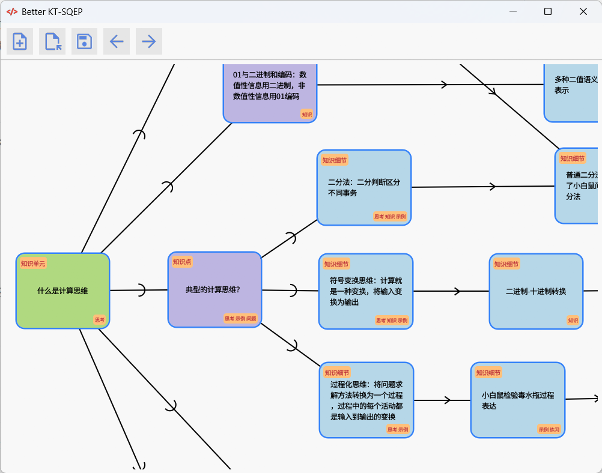

# Better KT-SQEP

一个 **兼容 KT-SQEP**，但更**稳定、更人性化、更快的**知识图谱绘制工具。

> 注：KT-SQEP 是一个知识图谱工具，用于战德臣老师所授课程的知识图谱绘制要求。

### 如果对您有所帮助，希望点一个免费的 star⭐，谢谢！

## 有关课程

哈尔滨工业大学

- CS64006	高级数据库系统
- CS65003	企业资源规划与供应链管理系统
- *...... 欢迎进行补充*

## 特点

- **不闪退，不闪退，不闪退**
- 支持自动保存
- 支持撤销与恢复
- 支持快捷键
- 操作方式更人性化
- 性能更高
- 单个程序即可运行

## 下载

[点击前往下载](https://github.com/zmsbruce/better_kt_sqep/releases)

## 使用方式

见 [USEGE.md](./USAGE.md)

## 兼容情况

支持 KT-SQEP 的教学知识图谱，包括：

- 内容型独立实体
  - 知识领域
  - 知识单元
  - 知识点
  - 关键知识细节
- 附加实体类型
  - 知识 K
  - 思维 T
  - 示例 E
  - 问题 Q
  - 练习 P
  - 思政 Z
- 关系类型
  - 包含关系
  - 次序：次序关系

暂不支持：

- 能力知识图谱；
- 资源型独立实体；
- 关系类型
  - 次序：关键次序
  - 连接资源