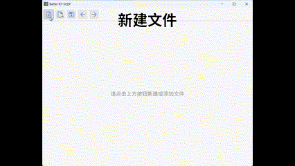
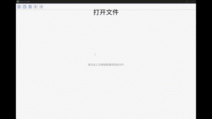
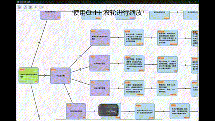
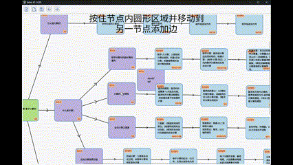
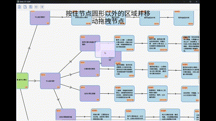
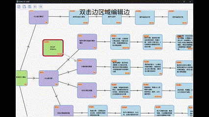
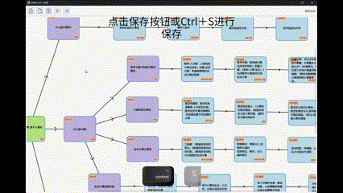

# 使用方式

1. 使用软件；
2. 使用 Python 绑定；

## 使用软件

新建文件：



打开文件：



移动：


缩放：



新建节点：


添加边：



改变节点位置：



编辑节点内容：


编辑边：



删除节点和边：


撤销与恢复：


显式保存：



## 使用 Python 绑定

在 [下载页面](https://github.com/zmsbruce/better_kt_sqep/releases) 中下载 Wheel 文件，之后使用 `pip install` 进行安装。

```python
from py_better_kt_sqep import KnowledgeGraph

# 初始化一个知识图谱
kg = KnowledgeGraph()

# 添加节点
#
# 参数：
# - content：节点内容
# - distinct_type：独立实体类型，分别是 ka (知识领域)、ku (知识单元)、kp (知识点)、kd (知识细节)
# - addon_types：附加实体类型，为 k (知识)、t (思维)、e (示例)、q (问题)、p (练习)、z (思政) 的组合
# - x：横坐标
# - y：纵坐标
#
# 返回：节点 id
entity_1 = kg.add_entity("这里是节点一", "ka", "kte", 0.0, 100.0)
entity_2 = kg.add_entity("这里是节点二", "ka", "kte", 100.0, 100.0)

# 添加边
#
# 参数：
# - from：边开始的节点 id
# - to：边指向的节点 id
# - relation：关系，为 contain (包含) 或者 order 次序
kg.add_edge(entity_1, entity_2, "contain")

# 删除边
#
# 参数：
# - from：边开始的节点 id
# - to：边指向的节点 id
kg.remove_edge(entity_1, entity_2)

# 删除节点
#
# 参数：
# - id：节点 id
kg.remove_entity(entity_2)

# 导出为 XML
#
# 返回：XML 字符串
xml = kg.to_xml()
```
